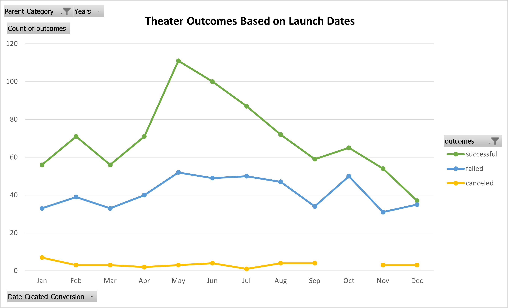
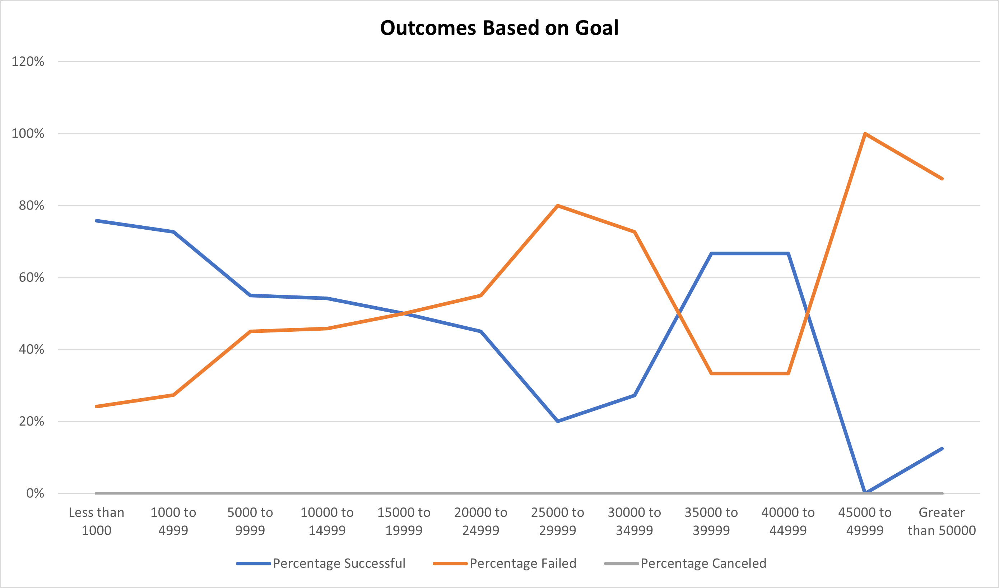

# Kickstarting with Excel

## Overview of Project
This project uses Excel to analyze Kickstarter campaign data. The data is used to visualize campaign outcomes based on their funding goals and launch dates.

### Purpose
Louise, our client, wants to maximize her chances of achieving a successful crowdfunding campaign. The Kickstarter data concentrated on the factors of failed, canceled, and successful play (theatre) campaigns. The data was analyzed to illustrate trends that show the relationship between the launch dates and fundraising goals on a campaign’s outcome.This analysis was performed by using Excel's formula functionalities, data filtering, and visualization tools.

## Analysis and Challenges:
 
### Analysis of Outcomes Based on Launch Date
Data was filtered to focus on the launch dates of successful, failed, and canceled Kickstarter theater campaigns. The chart illustrates which months out of the year have the most successful outcomes and which months have the least successful campaign outcomes. The graph shows that the highest count of successful outcomes occurred between May and June, with a total of 211 successful campaigns (25% of the total successful campaigns). In contrast, the fundraising campaigns were the least successful in December, with only 37 (or 4%) successful campaigns.

The failed campaign outcomes did not show enough consistency in the data to conclude a trend. What can be concluded about failed outcomes is that when there are months that have more launch attempts, there is a possibility that the failed outcomes can increase. Such as the duration of May to July, for example. It is a given that more launch attempts increase the possibility of outcomes for both success and failures. As a result, this conclusion can be ignored.

### Analysis of Outcomes Based on Goals

### Challenges and Difficulties Encountered

## Results

- What are two conclusions you can draw about the Outcomes based on Launch Date?

- What can you conclude about the Outcomes based on Goals?

- What are some limitations of this dataset?

- What are some other possible tables and/or graphs that we could create?
